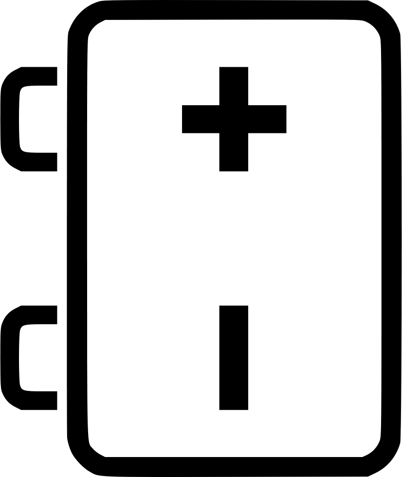

### 1)AND Gate
 

#### Simulator 1:
Step-1) Connect the supply(+5V)  &nbsp;&nbsp;   &nbsp;&nbsp;to the circuit. 
Step-2) Press the switches for inputs "A"  and "B". 
        The switch in ON state is&nbsp;&nbsp; &nbsp;&nbsp; and the switch in OFF state is  &nbsp;&nbsp;  
Step-3) The bulb does not glow if any one or both the switches (2 and 3) are OFF and glows only if  both the switches (2 and 3) are ON.</b>  
        The bulb in OFF state is  and the bulb in ON state is  . 
Step-4) Repeat step-2 and step-3 for all state of inputs.  

#### Simulator 2:
Step-1) Enter the Boolean input "A" and "B". 
Step-2) Enter the Boolean output for your corresponding inputs. 
Step-3) Click on "Check" Button to verify your output. 
Step-4) Click "Print" if you want to get print out of Truth Table. 

### 2)OR Gate
 

#### Simulator 1:
Step-1) Connect the supply(+5V)  &nbsp;&nbsp;   &nbsp;&nbsp;to the circuit. 
Step-2) Press the switches for inputs "A"  and "B". 
        The switch in ON state is&nbsp;&nbsp; &nbsp;&nbsp; and the switch in OFF state is  &nbsp;&nbsp; 
Step-3) The bulb glows if any one or both the switches are ON else it won't glow. 
        The bulb in OFF state is  and the bulb in ON state is  . 
Step-4) Repeat step-2 and step-3 for all state of inputs.  

#### Simulator 2:
Step-1) Enter the Boolean input "A" and "B". 
Step-2) Enter the Boolean output for your corresponding inputs. 
Step-3) Click on "Check" Button to verify your output. 
Step-4) Click "Print" if you want to get print out of Truth Table. 
                        

### 3)NOT gate
 

#### Simulator 1:
Step-1) Connect the supply(+5V)  &nbsp;&nbsp;   &nbsp;&nbsp;to the circuit. 
Step-2) Press the switch 1 to connect battery to the circuit. 
Step-3) Press the switch 2 for input "A" . 
        The switch in ON state is&nbsp;&nbsp; &nbsp;&nbsp; and the switch in OFF state is  &nbsp;&nbsp; 
Step-4) The bulb glows if switch 2 is OFF else it won't glow. 
        The bulb in OFF state is  and the bulb in ON state is  .  

#### Simulator 2:
Step-1) Enter the Boolean input "A". 
Step-2) Enter the Boolean output for your corresponding input. 
Step-3) Click on "Check" Button to verify your output. 
Step-4) Click "Print" if you want to get print out of Truth Table. 

### 4)NAND gate 
 

#### Simulator 1:
Step-1) Connect the supply(+5V)  &nbsp;&nbsp;   &nbsp;&nbsp;to the circuit. 
Step-2) Press the switch 1 to connect battery to the circuit. 
Step-3) Press the switches 2 and 3 for inputs "A" and "B". 
        The switch in ON state is&nbsp;&nbsp; &nbsp;&nbsp; and the switch in OFF state is  &nbsp;&nbsp; 
Step-4) The bulb glows if any one or both the switches are OFF else it won't glow. 
        The bulb in OFF state is  and the bulb in ON state is  .  

#### Simulator 2:
Step-1) Enter the Boolean input "A" and "B". 
Step-2) Enter the Boolean output for your corresponding inputs. 
Step-3) Click on "Check" Button to verify your output. 
Step-4) Click "Print" if you want to get print out of Truth Table. 

### 5)NOR gate
 

#### Simulator 1:
Step-1) Connect the supply(+5V)  &nbsp;&nbsp;   &nbsp;&nbsp;to the circuit. 
Step-2) Press the switch 1 to connect battery to the circuit. 
Step-3) Press the switches 2 and 3 for inputs "A" and "B". 
        The switch in ON state is&nbsp;&nbsp; &nbsp;&nbsp; and the switch in OFF state is  &nbsp;&nbsp; 
Step-4) The bulb glows if both the switches are OFF else it won't glow. 
        The bulb in OFF state is  and the bulb in ON state is  .  
                    

#### Simulator 2:
Step-1) Enter the Boolean input "A" and "B". 
Step-2) Enter the Boolean output for your corresponding inputs. 
Step-3) Click on "Check" Button to verify your output. 
Step-4) Click "Print" if you want to get print out of Truth Table. 

### 6)Ex-OR gate 
 

#### Simulator 1:
Step-1) Connect the supply(+5V)  &nbsp;&nbsp;   &nbsp;&nbsp;to the circuit &nbsp;&nbsp;. 
Step-2) Press the switches for inputs "A"  and "B". 
        The switch in ON state is&nbsp;&nbsp; &nbsp;&nbsp; and the switch in OFF state is  &nbsp;&nbsp; 
Step-3) The bulb glows if one of the switches is ON and one of the switches is OFF else it won't glow. 
        The bulb in OFF state is  and the bulb in ON state is  .  

#### Simulator 2:
Step-1) Enter the Boolean input "A" and "B". 
Step-2) Enter the Boolean output for your corresponding inputs. 
Step-3) Click on "Check" Button to verify your output. 
Step-4) Click "Print" if you want to get print out of Truth Table. 

### 7)Ex-NOR gate 
 

#### Simulator 1:
Step-1) Connect the supply(+5V)  &nbsp;&nbsp;   &nbsp;&nbsp;to the circuit &nbsp;&nbsp;. 
Step-2) Press the switches for inputs "A"  and "B". 
        The switch in ON state is&nbsp;&nbsp; &nbsp;&nbsp; and the switch in OFF state is  &nbsp;&nbsp; 
Step-3) The bulb glows if both the switches are ON or if both the switches are OFF else it won't glow. 
        The bulb in OFF state is  and the bulb in ON state is  . 

#### Simulator 2:
Step-1) Enter the Boolean input "A" and "B". 
Step-2) Enter the Boolean output for your corresponding inputs. 
Step-3) Click on "Check" Button to verify your output. 
Step-4) Click "Print" if you want to get print out of Truth Table. 
                 
