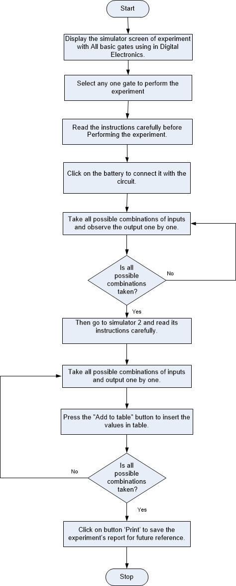
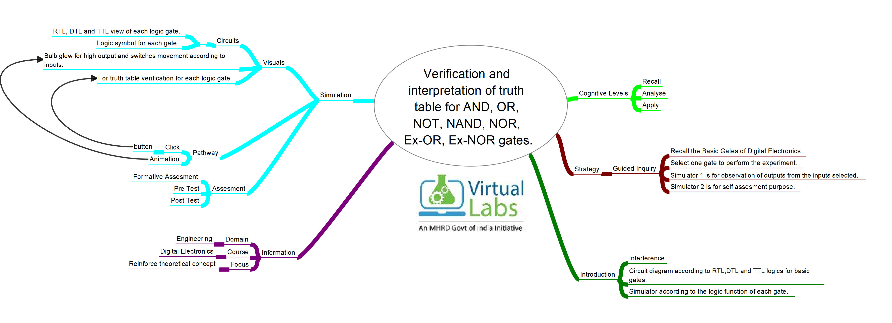

## Storyboard (Round 2)

Experiment 1: Verification and interpretation of truth table for AND, OR, NOT, NAND. NOR, Ex-OR, Ex-NOR gates. 

### 1. Story Outline:

This experiment contains the simulation of each basic gate to verify its logic and truth table. There are two simulators for each basic gate. In simulator 1 student can observe the output on the bulb according to input provided through voltage pins while in simulator 2 student has to select both inputs as well as the output and check the results. 

### 2. Story:

AND GATE:  Circuit shown in Simulator 1 contains AND gate with Diode logic in which the bulb at the output glows only if both the switches for two inputs are in ON state. Simulator 2 is for the assessment of the knowledge which user gains by working on simulator 1. Provide binary input to simulator, predict the output of AND gate and verify it by truth table. 

OR GATE:  Circuit shown in Simulator 1 contains OR gate with Diode Logic in which the bulb at the output glows if any one or both the switches for two inputs are in ON state. Simulator 2 is for the assessment of the knowledge which user gains by working on simulator 1. Provide binary input to simulator, predict the output of OR gate and verify it by truth table.   

NOT GATE:  Circuit shown in Simulator 1 contains transistor as NOT gate in which the bulb at the output glows if the switch for its input is in OFF state. Simulator 2 is for the assessment of the knowledge which user gains by working on simulator 1. Provide binary input to simulator, predict the output of NOT gate and verify it by truth table. 

NAND GATE:  Circuit shown in Simulator 1 contains NAND gate with RTL (Resistor Transistor Logic) in which the bulb at the output glows if either one of them is in OFF state or both switches for its input are in OFF state. Simulator 2 is for the assessment of the knowledge which user gains by working on simulator 1. Provide binary input to simulator, predict the output of NAND gate and verify it by truth table. 

NOR GATE:  Circuit shown in Simulator 1 contains NOR gate with RTL (Resistor Transistor Logic) in which the bulb at the output glows if both the switches for its input are in OFF state. Simulator 2 is for the assessment of the knowledge which user gains by working on simulator 1. Provide binary input to simulator, predict the output of NOR gate and verify it by truth table. 

Ex-OR GATE:  Circuit shown in Simulator 1 contains Ex-OR gate with RTL (Resistor Transistor Logic) in which the bulb at the output glows if both the switches for its input are in different states. Simulator 2 is for the assessment of the knowledge which user gains by working on simulator 1. Provide binary input to simulator, Predict the output of Ex-OR gate and verify it by truth table. 

Ex-NOR GATE:  Circuit shown in Simulator 1 contains Ex-NOR gate using RTL (Resistor Transistor Logic) in which the bulb at the output glows if both the switches for its input are in same states. Simulator 2 is for the assessment of the knowledge which user gains by working on simulator 1. Provide binary input to simulator, Predict the output of Ex-NOR gate and verify it by truth table. 

#### 2.1 Set the Visual Stage Description:
The set-up in simulator 1 consists of switches, bulb, diode, transistor, battery, and wires assembled to make a complete circuit for each basic gate. While simulator 2 consists of a simple logic symbol of each gate to verify the logic function. 

#### 2.2 Set User Objectives & Goals:
1. The prime objective of the experiment is to verify the logic function and truth table of each basic gate. 
2. To understand how it basic gates work. 
3. To understand and appreciate the change in the output according to inputs provided. 
4. To apply the above the combination of the input and observe the output on the bulb. 
5. To use the logic function of each basic gate to calculate the output. 
6. To verify the truth table of each basic gate. 
7. Compare the observed and the truth table with all basic gates. 
8. Attempt the assessment questions. 

#### 2.3 Set the Pathway Activities:

Simulator 1: 
Step-1) Connect the supply(+5V) to the circuit. 
Step-2) Press the switches for inputs "A"  and "B". 
Step-3) The bulb glows if anyone or both the switches are ON else it won't glow. 
Step-4) Repeat step-2 and step-3 for all state of inputs. 
                     

Simulator 2: 
1) Enter the Boolean input "A" and "B". 
2) Enter the Boolean output for your corresponding inputs. 
3) Click on "Check" Button to verify your output. 
4) Click "Print" if you want to get print out of Truth Table. 

##### 2.4 Set Challenges and Questions/Complexity/Variations in Questions:

Question 1.
Electronic circuits that operate on one or more input signals to produce standard output ___________ 

A   Series circuits 
B   Parallel circuits 
C   Logic signals 
D   Logic gates 

 

 

Question 2.
A __________ gate gives the output as 1 only if all the inputs signals are 1. 

A   AND 
B   OR 
C   NOR 
D   Ex-OR 

 

 

Question 3.
The boolean expression of an OR gate is _______ 

A   A.B 
B   A’B+AB’ 
C   A+B 
D   A’B’ 

 

 

Question 4.
The gate which is used to reverse the output obtained is _____ 

A   NOR 
B   NAND 
C   EX-OR 
D   NOT 

 

 

Question 5.
Which of the following gate will give a 0 when both of its inputs are 1? 

A   AND 
B   OR 
C   NAND 
D   EX-OR 

##### 2.5 Allow pitfalls:
1. Battery must be connected to the circuit before applying the inputs. 

2. For each combination of input click on ADD button to add the values in the truth table. 

##### 2.6 Conclusion:
To understand the truth table and logic function for each basic gate and simulator 2 is for self-assessment after performing the experiment on simulator 1. The assessment questions provide a basic idea about the experiment and theory is also sufficient to understand the experiment.

##### 2.7 Equations/formulas: NA
AND GATE:  Y= A.B 

OR GATE:  Y= A+B 

NOT GATE: Y= A' 

NAND GATE:  Y=(AB)' 

OR GATE:  Y=(A+B)' 

Ex-OR GATE:  Y=A'B+AB' 

Ex-NOR GATE: Y= AB+A'B' 

### 3. Flowchart 4
 

### 4. Mindmap:

  

### 5. Storyboard :
Storyboard: 
