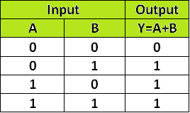
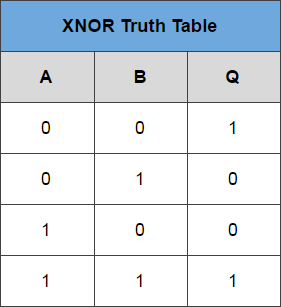
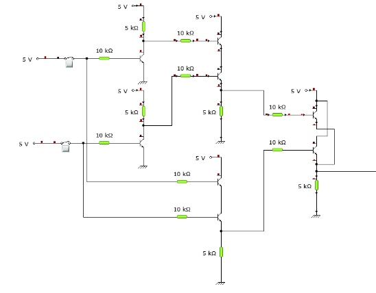

### Introduction
 
Logic gates are the basic building blocks of any digital system. Logic gates are electronic circuits having one or more than one input and only one output. The relationship between the input and the output is based on a certain logic. Based on this, logic gates are named as 

1) AND gate 
2) OR gate 
3) NOT gate 
4) NAND gate 
5) NOR gate 
6) Ex-OR gate 
7) Ex-NOR gate 

### 1) AND gate
 
The AND gate is an electronic circuit that gives a high output (1) only if all its inputs are high. A dot (.) is used to show the AND operation i.e. A.B or can be written as AB 

<b>Y= A.B</b> 
   <b>Figure-1:Logic Symbol of AND Gate</b>      
  <b>Figure-2:Truth Table of AND Gate</b>
  

A simple 2-input logic AND gate can be constructed using RTL (Resistor-Transistor-Logic) switches connected together as shown below with the inputs connected directly to the transistor bases. Both transistors must be saturated “ON” for an output at Q.</b>
 

  
<b>Figure-3:AND Gate through RTL logic</b>
 

   
  
  

### 2) OR gate
The OR gate is an electronic circuit that gives a high output (1) if one or more of its inputs are high.  A plus (+) is used to show the OR operation.  

<b>Y= A+B</b>
 
 <b>Figure-4:Logic Symbol of OR Gate</b>  
   <b>Figure-5:Truth Table of OR Gate</b> 

OR gate can be realized by DRL (Diode-Resistance-Logic) or by TTL (Transistor-Transistor-Logic). Presently, we will learn how to implement the OR gate using DRL (Diode-Resistance-Logic). To realise OR gate, we will use a diode at every input of the OR gate. The anode part of diode is connected with input while the cathode part is joined together and a resistor, connected with the cathode is grounded. In this case, we have taken two inputs which can be seen in the circuit below. 

When both the inputs are at logic 0 or low state then the diodes D1 and D2 become reverse biased. Since the anode terminal of diode is at lower voltage level than the cathode terminal, so diode will act as open circuit so there is no voltage across resistor and hence output voltage is same as ground. When either of the diodes is at logic 1 or high state then the diode corresponding to that input is forward bias. Since this time anode is at high voltage than cathode therefore current will flow through forward biased diode and this current then appears on resistor causing high voltage at output terminal also. Hence at output we get high or logic 1 or +5V. So, if any or both inputs are high, the output will be high or “1”. 

  <b>Figure-6:OR Gate through DRL logic</b>

  
      
  
### 3) NOT gate
 
The NOT gate is an electronic circuit that produces an inverted version of the input at its output.  It is also known as an inverter.  If the input variable is A, the inverted output is known as NOT A.  This is also shown as A' or A with a bar over the top, as shown at the outputs.
  

<b>Y= A'</b> 

  <b>Figure-7:Logic Symbol of NOT Gate</b> 
  <b>Figure-8:Truth Table of NOT Gate</b>   

NOT gate can be realized through transistor.The input is connected through resistor R2 to the transistor’s base. When no voltage is present on the input, the transistor turns off. When the transistor is off, no current flows through the collector-emitter path. Thus, current from the supply voltage (Vcc) flows through resistor R1 to the output. In this way, the circuit’s output is high when its input is low.

When voltage is present at the input, the transistor turns on, allowing current to flow through the collector-emitter circuit directly to ground. This ground path creates a shortcut that bypasses the output, which causes the output to go low.

In this way, the output is high when the input is low and low when the input is high.</b>
 

  
<b>Figure-9:NOT Gate through Transistor</b>
  

      
  

### 4) NAND gate
This is a NOT-AND gate which is equal to an AND gate followed by a NOT gate.  The outputs of all NAND gates are high if any of the inputs are low. The symbol is an AND gate with a small circle on the output. The small circle represents inversion.  

<b>Y= AB</b>

 

 <b>Figure-10:Logic Symbol of NAND Gate</b> 
 <b>Figure-11:Truth Table of NAND Gate</b>  

A simple 2-input logic NAND gate can be constructed using RTL (Resistor-transistor-logic) switches connected together as shown below with the inputs connected directly to the transistor bases. Either transistor must be cut-off or “OFF” for an output at Q.</b>
 

  <b>Figure-12:NAND gate through RTL Logic.</b>
  

### 5) NOR gate
 
This is a NOT-OR gate which is equal to an OR gate followed by a NOT gate.  The outputs of all NOR gates are low if any of the inputs are high.
The symbol is an OR gate with a small circle on the output. The small circle represents inversion.
  

<b>Y= A+B</b>
 
 <b>Figure-13:Logic Symbol of NOR gate</b> 
  <b>Figure-14:Truth Table of NOR gate</b> 

A simple 2-input logic NOR gate can be constructed using RTL (Resistor-transistor-logic) switches connected together as shown below with the inputs connected directly to the transistor bases. Both transistors must be cut-off or “OFF” for an output at Q. 

  
<b>Figure-15:NOR gate through RTL Logic.</b>

       
 

### 6) Ex-OR gate
 
The 'Exclusive-OR' gate is a circuit which will give a high output if either, but not both of its two inputs are high.  An encircled plus sign (⊕) is used to show the Ex-OR operation.
  

<b>Y= A⊕B</b> 

  <b>Figure-16:Logic Symbol of Ex-OR gate</b> 
  <b>Figure-17:Truth Table of Ex-OR gate</b> 

Ex-OR gate is created from AND, NAND and OR gates.The output is high only when both the inputs are different.</b>
 

  <b>Figure-18:Ex-OR gate through RTL Logic.</b>
  

### 7) Ex-NOR gate 
 
The 'Exclusive-NOR' gate circuit does the opposite to the EX-OR gate. It will give a low output if either, but not both of its two inputs are high. The symbol is an EX-OR gate with a small circle on the output. The small circle represents inversion.  

<b>Y= A⊕B</b>
  
 
  <b>Figure-19:Logic Symbol of Ex-NOR gate</b> 
  <b>Figure-20:Truth Table of Ex-NOR gate</b> 

Ex-NOR gate is created from AND, NOT and OR gates.The output is high only when both the inputs are same.

   
      
<b>Figure-21:Ex-NOR gate through RTL Logic.</b>
 

